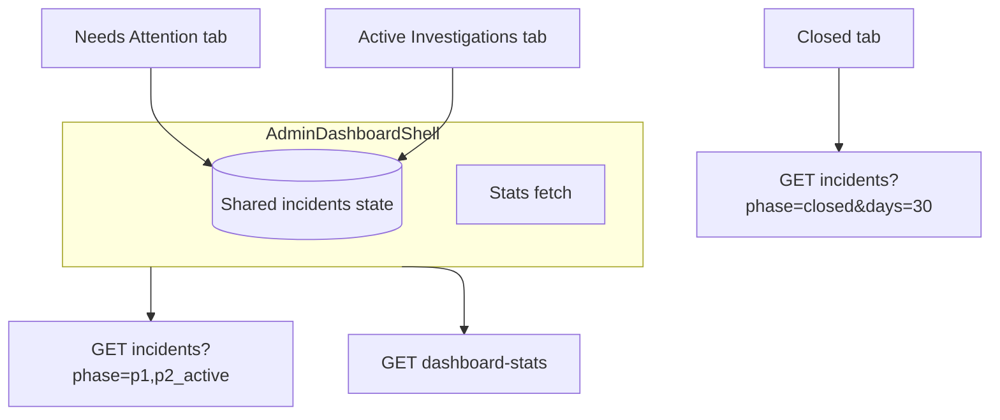

# WAiK Admin Dashboard

**Version**: 1.0  
**Last Updated**: December 2024  
**Role**: Admin (Supervisors, Directors, Compliance Officers)

---

## Table of Contents

1. [Overview](#overview)
2. [Access & Authentication](#access--authentication)
3. [Layout & Navigation](#layout--navigation)
4. [Dashboard Features](#dashboard-features)
5. [Incident Management](#incident-management)
6. [Admin Incident Detail](#admin-incident-detail)
7. [Key Differences from Staff](#key-differences-from-staff)

---

## Overview

The Admin Dashboard provides supervisory oversight of all incidents across the facility:
- View ALL incidents (not just assigned ones)
- Monitor facility-wide statistics
- Access detailed incident analytics
- Generate and review AI reports

```
┌─────────────────────────────────────────────────────────────────────────────┐
│                         ADMIN DASHBOARD OVERVIEW                            │
├─────────────────────────────────────────────────────────────────────────────┤
│                                                                             │
│   ┌──────────────────┐    ┌─────────────────────────────────────────────┐   │
│   │     SIDEBAR      │    │                                             │   │
│   │                  │    │   ┌───────┐ ┌───────┐ ┌───────┐ ┌───────┐   │   │
│   │  WAiK Logo       │    │   │ Total │ │ Open  │ │Urgent │ │Resolved│   │   │
│   │  Admin Portal    │    │   │  (47) │ │ (12)  │ │  (3)  │ │ (32)   │   │   │
│   │  Admin Name      │    │   └───────┘ └───────┘ └───────┘ └───────┘   │   │
│   │                  │    │                                             │   │
│   │  ──────────────  │    │   ┌─────────────────────────────────────┐   │   │
│   │                  │    │   │                                     │   │   │
│   │  Dashboard       │    │   │         ALL INCIDENTS               │   │   │
│   │  New Incident    │    │   │    (Full facility access)           │   │   │
│   │                  │    │   │                                     │   │   │
│   │  ──────────────  │    │   │   • Search & Filter                 │   │   │
│   │                  │    │   │   • Click to view details           │   │   │
│   │  Logout          │    │   │   • Manage any incident             │   │   │
│   │                  │    │   │                                     │   │   │
│   └──────────────────┘    │   └─────────────────────────────────────┘   │   │
│                           │                                             │   │
│                           └─────────────────────────────────────────────┘   │
│                                                                             │
└─────────────────────────────────────────────────────────────────────────────┘
```

---

## Access & Authentication

### Route Protection

```typescript
// app/admin/layout.tsx
<AuthGuard allowedRoles={["admin"]}>
  {children}
</AuthGuard>
```

Only users with `role: "admin"` can access `/admin/*` routes.

### Login Flow

```
/waik-demo-start/login → Enter credentials → 
If role === "admin" → Redirect to /admin/dashboard
If role === "staff" → Redirect to /staff/dashboard
```

---

## Layout & Navigation

### File Structure

```
app/admin/
├── layout.tsx              # Admin layout with sidebar
├── dashboard/
│   ├── page.tsx            # Main dashboard (all incidents)
│   └── loading.tsx         # Loading state
└── incidents/
    └── [id]/
        └── page.tsx        # Incident detail view (admin version)
```

### Sidebar Navigation

| Button | Route | Description |
|--------|-------|-------------|
| **Dashboard** | `/admin/dashboard` | View all facility incidents |
| **New Incident** | `/incidents/create` | Create new incident |

**Note**: Admin sidebar is simpler because admins primarily review and manage rather than create reports.

### Command Center (`/admin/dashboard`, Phase 3b)



**Role gates:** `app/admin/layout.tsx` requires **`isAdminTier` or `isWaikSuperAdmin`**. Staff are redirected to **`/staff/dashboard`**. Phase transitions that claim Phase 2 or close an investigation require **`canAccessPhase2`** (or super admin) on **`PATCH /api/incidents/[id]/phase`**.

**One incident list for two tabs:** The shell performs a single **`GET /api/incidents?phase=phase_1_in_progress,phase_1_complete,phase_2_in_progress`** on load and every **60s**. **Needs Attention** and **Active Investigations** both read that shared state (no duplicate list request). The **Closed** tab uses a separate **`GET ...?phase=closed&days=30`**.

**`IncidentSummary` (lists):** See `lib/types/incident-summary.ts`. Dashboard cards use **`residentRoom`** only — no resident name on list surfaces.

**Classification (`lib/utils/incident-classification.ts`):** **`classifyIncident`** drives red vs yellow on Needs Attention. **`isIdtOverdue`** flags IDT members pending more than **24h** since **`questionSentAt`**. **`computeClock(phase1SignedAt)`** powers the **48h** regulatory clock on the Active tab (gray / amber / red / overdue thresholds).

**Stats:** **`GET /api/admin/dashboard-stats`** — Mongo aggregations, **Redis** cache key **`waik:stats:{facilityId}`**, TTL **300s** (see task-06e).

**Push:** **`POST /api/push/send`** is a **stub** (logs intent, `delivered: false`) until **task-12** replaces it with real web push.

---

## Dashboard Features

### Facility-Wide Statistics

```typescript
const stats = {
  totalIncidents: incidents.length,
  openIncidents: incidents.filter((i) => 
    i.status === "open" || i.status === "in-progress"
  ).length,
  urgentIncidents: incidents.filter((i) => 
    i.priority === "urgent"
  ).length,
  resolvedThisWeek: incidents.filter((i) => 
    i.status === "closed"
  ).length,
}
```

| Card | Color | Description |
|------|-------|-------------|
| **Total Incidents** | Primary | All-time incident count |
| **Open Incidents** | Accent | Need attention (open + in-progress) |
| **Urgent** | Orange | Immediate action required |
| **Resolved This Week** | Green | Successfully closed |

### Data Access

```typescript
// Admin fetches ALL incidents, not filtered by staffId
const fetchIncidents = async () => {
  const response = await fetch("/api/incidents")  // No staffId filter
  const data = await response.json()
  setIncidents(data)
}
```

### Closed tab (last 30 days)

On **`/admin/dashboard`**, the **Closed** tab lists investigations in phase **`closed`** whose **`phase2Locked`** timestamp falls within the last **30 days** (`GET /api/incidents?phase=closed&days=30`). The table shows room, lock date (e.g. Today / Yesterday / `MMM d`), completeness at sign-off, investigator, and **days to close** (phase 2 locked minus phase 1 signed). A subtitle shows the count for that window.

**Export CSV** generates `waik-closed-incidents-[YYYY-MM-DD].csv` in the browser from the loaded rows (`lib/utils/csv-export.ts`): room numbers and investigation metadata only, no resident names by default.

### Quick stats sidebar + daily brief

- **`GET /api/admin/dashboard-stats`** (admin-auth) returns 30-day / prior-30-day aggregates from MongoDB: incident counts, average completeness, average days to close (closed investigations in each window), injury-flag percentage, and upcoming assessments in the next 7 days. Results are cached in **Redis** for **5 minutes** under key `waik:stats:{facilityId}` (cache read/write failures fall back to uncached aggregation).
- The **right column** on desktop (`StatsSidebar`) shows those metrics with **trend arrows** vs the prior 30 days. On small screens the same block stacks **below** the tabs.
- The **daily brief** appears once per calendar day until dismissed (**`localStorage`** key `waik-brief-dismissed-{YYYY-MM-DD}`) and summarizes recent totals from the same stats payload.
- The sidebar **“Ask your community…”** field navigates to **`/admin/intelligence?q=…`** on Enter.

### Needs Attention — Overdue IDT (task-06f)

Below red and yellow sections, **Overdue IDT Tasks** lists each IDT member on a Phase 2 investigation where `isIdtOverdue()` is true (pending question sent more than **24 hours** ago). Each card shows name, role, room + incident type, hours beyond that threshold, and **Send Reminder**, which calls **`POST /api/push/send`** (stub: logs intent, returns `delivered: false` until task-12). The **Needs Attention** tab badge counts red + yellow + **one per overdue member**.

---

## Incident Management

### Full Facility View

Unlike staff who only see their assigned incidents, admins see everything:

| Admin | Staff |
|-------|-------|
| All incidents | Only assigned incidents |
| All staff names | Own name only |
| All question/answers | Questions assigned to them |
| Can assign questions | Can only answer |

### Search & Filter

Same as staff dashboard:
- Search by resident name, title, room
- Filter by status and priority
- Sort by date, priority, or resident name

### Priority Badges

```typescript
const getPriorityBadge = (priority: string) => {
  switch (priority) {
    case "urgent": return <Badge className="bg-orange-500">Urgent</Badge>
    case "high": return <Badge variant="destructive">High</Badge>
    case "medium": return <Badge className="bg-yellow-500">Medium</Badge>
    case "low": return <Badge variant="secondary">Low</Badge>
  }
}
```

### Status Badges

```typescript
const getStatusBadge = (status: string) => {
  switch (status) {
    case "open": return <Badge variant="outline">Open</Badge>
    case "in-progress": return <Badge variant="secondary">In Progress</Badge>
    case "pending-review": return <Badge className="bg-blue-500">Pending Review</Badge>
    case "closed": return <Badge className="bg-green-500">Closed</Badge>
  }
}
```

---

## Admin Incident Detail

### File

`app/admin/incidents/[id]/page.tsx`

### Admin-Specific Features

The admin incident detail page has the same structure as staff (Overview, Q&A, Intelligence, WAiK Agent tabs) but with additional capabilities:

#### 1. Question Assignment

Admins can assign questions to specific staff members:

```typescript
const handleAssignQuestion = async (questionId: string) => {
  const response = await fetch(
    `/api/incidents/${incidentId}/questions/${questionId}/assign`,
    {
      method: "PATCH",
      body: JSON.stringify({ assignedTo: selectedEmployees }),
    }
  )
}
```

#### 2. Create New Questions

Admins can create additional questions:

```typescript
const handleAddQuestion = async () => {
  await fetch(`/api/incidents/${incidentId}/questions`, {
    method: "POST",
    body: JSON.stringify({
      questionText: newQuestion,
      askedBy: userId,
      assignedTo: selectedStaff,
    }),
  })
}
```

#### 3. Generate AI Reports

Admins can trigger AI report generation:

```typescript
const handleGenerateAIReport = async () => {
  await fetch(`/api/incidents/${incidentId}/ai-report`, {
    method: "POST",
  })
}
```

#### 4. Status Management

Admins can change incident status:

```typescript
const handleUpdateStatus = async (newStatus: string) => {
  await fetch(`/api/incidents/${incidentId}`, {
    method: "PATCH",
    body: JSON.stringify({ status: newStatus }),
  })
}
```

### Admin Incident Detail Tabs

| Tab | Admin Capabilities |
|-----|-------------------|
| **Overview** | View all details, change status |
| **Q&A** | View all Q&A, create questions, assign staff |
| **Intelligence** | Full access to AI Q&A |
| **WAiK Agent** | View and regenerate AI reports |

---

## Key Differences from Staff

### Access Level

| Feature | Admin | Staff |
|---------|-------|-------|
| View all incidents | ✅ | ❌ (only assigned) |
| Create questions | ✅ | ❌ |
| Assign questions | ✅ | ❌ |
| Change status | ✅ | ❌ |
| Generate AI reports | ✅ | ❌ |
| Answer questions | ✅ | ✅ |
| Use Intelligence | ✅ | ✅ |
| Create incidents | ✅ | ✅ |

### Statistics Scope

| Metric | Admin | Staff |
|--------|-------|-------|
| Total Incidents | All facility | Assigned only |
| Open Incidents | All facility | Assigned only |
| Pending Questions | All facility | Their questions only |
| Completed | All facility | Their completions |

### Notification Scope

- **Admin**: May see all notifications (depending on implementation)
- **Staff**: Only sees notifications for their assigned incidents

### API Endpoints

| Endpoint | Admin Access | Staff Access |
|----------|--------------|--------------|
| `GET /api/incidents` | ✅ All | ❌ |
| `GET /api/staff/incidents?staffId=` | ✅ | ✅ (own only) |
| `POST /api/incidents/{id}/questions` | ✅ | ❌ |
| `PATCH /api/incidents/{id}/questions/{qId}` | ✅ | ❌ |
| `POST /api/incidents/{id}/ai-report` | ✅ | ❌ |
| `PATCH /api/incidents/{id}` | ✅ | ❌ |

---

## Admin Workflow

### 1. Review New Incidents

```
Dashboard → Sort by "Newest First" → Click incident
→ Review narrative → Check AI-generated questions
→ (Optional) Add more questions → Assign to staff
```

### 2. Monitor Question Responses

```
Dashboard → Filter by "Pending Review" → Click incident
→ Q&A Tab → Review answers → Mark questions complete
→ Generate AI Report if needed
```

### 3. Close Incident

```
Incident Detail → Verify all questions answered
→ Review AI Report → Update status to "Closed"
→ Return to dashboard
```

### 4. Escalate Urgent Incident

```
Dashboard → Filter "Urgent" → Click incident
→ Add priority questions → Assign to multiple staff
→ Use Intelligence to check details
→ Follow up as needed
```

---

## State Management

### Admin-Specific State

```typescript
// Additional state for admin features
const [newQuestion, setNewQuestion] = useState("")
const [selectedStaff, setSelectedStaff] = useState<string[]>([])
const [staffList, setStaffList] = useState<Staff[]>([])
const [isGeneratingReport, setIsGeneratingReport] = useState(false)
```

### Staff List for Assignment

```typescript
const fetchStaffList = async () => {
  const response = await fetch("/api/users")
  const users = await response.json()
  const staff = users.filter(u => u.role === "staff")
  setStaffList(staff)
}
```

---

## UI Components

### Admin-Only Components

1. **Question Creator**
   - Text input for new question
   - Multi-select for staff assignment
   - Submit button

2. **Status Changer**
   - Dropdown with status options
   - Confirmation on change

3. **Report Generator**
   - "Generate AI Report" button
   - Loading state during generation
   - Success/error feedback

4. **Staff Selector**
   - Searchable staff list
   - Multi-select checkboxes
   - Selected count indicator

---

## API Dependencies

| Endpoint | Method | Purpose |
|----------|--------|---------|
| `/api/incidents` | GET | Fetch ALL incidents |
| `/api/incidents/{id}` | GET | Single incident |
| `/api/incidents/{id}` | PATCH | Update status/priority |
| `/api/incidents/{id}/questions` | POST | Add question |
| `/api/incidents/{id}/questions/{qId}` | PATCH | Assign question |
| `/api/incidents/{id}/ai-report` | POST | Generate AI report |
| `/api/users` | GET | List staff for assignment |

---

## Related Documentation

- [10-STAFF-DASHBOARD.md](./10-STAFF-DASHBOARD.md) - Staff capabilities
- [12-INCIDENT-FORMS.md](./12-INCIDENT-FORMS.md) - Incident creation
- [03-API-REFERENCE.md](./03-API-REFERENCE.md) - API documentation

---

*The Admin Dashboard provides comprehensive facility oversight while maintaining the same intuitive interface as the Staff Dashboard.*

